# Manual de Despliegue - Proyecto Integrador (UD5)

**Módulo:** Despliegue de Aplicaciones Web
**Autor:** Pablo Jiménez Pinto

---

## Apartado 1 (RA1): Arquitectura y Preparación del Entorno

**Objetivo:** Configurar la red del entorno de trabajo con IP estática y levantar el sistema operativo base.

Para realizar este despliegue he optado por una arquitectura basada en contenedores utilizando **Docker**. Esta decisión me permite un aislamiento completo de los servicios y una alta reproducibilidad del entorno.

*   **Configuración de la red:** En el archivo `docker-compose.yml` he definido una red personalizada de tipo *bridge* llamada `red_daw`. Le he asignado estáticamente la subred `172.20.0.0/16`. Al contenedor principal (`daw_app`) le he fijado la IP estática `172.20.0.10`.
*   **Sistema Operativo Base:** He utilizado la imagen `httpd:alpine`, la cual proporciona un sistema operativo Linux minimalista (Alpine) con el servidor web Apache preinstalado, optimizando así el consumo de recursos.

**Prueba de configuración de la red:**

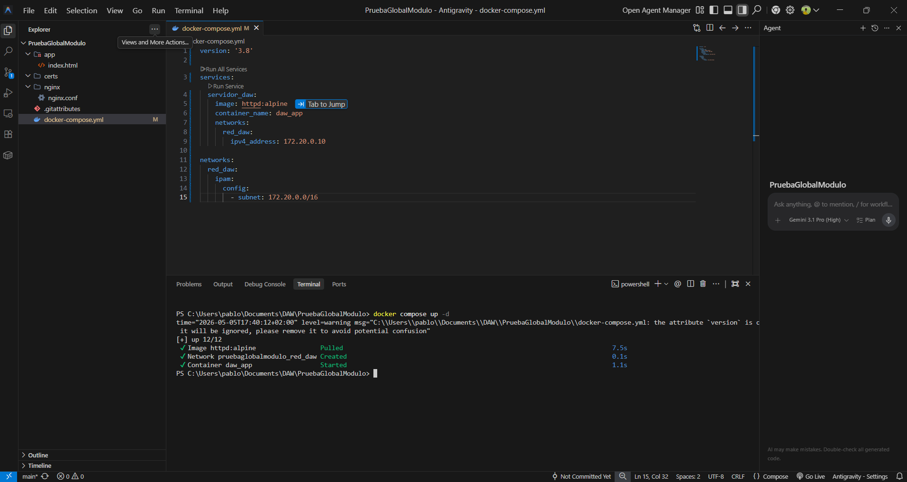

*En la captura superior verifico la correcta creación de la red en Docker, confirmando que la subred `172.20.0.0/16` se ha aplicado correctamente en la sección IPAM.*

**Comprobación de conectividad básica:**

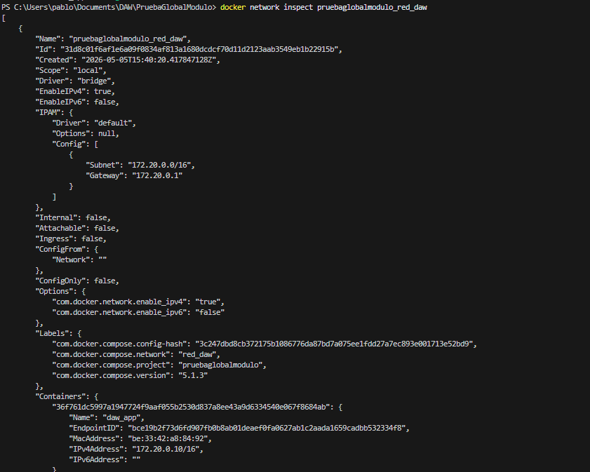
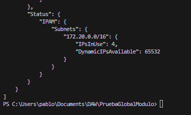
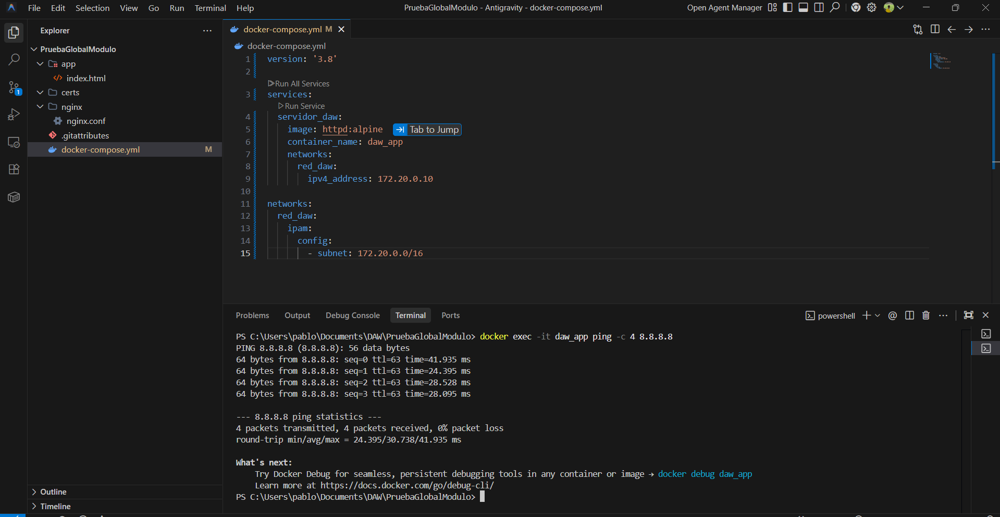

*Mediante el comando `docker exec -it daw_app ping 8.8.8.8` demuestro que el contenedor tiene salida a Internet, enviando y recibiendo paquetes (0% packet loss) de forma exitosa*.

---

## Apartado 2 (RA2): Servidor Web y Proxy Inverso Seguro

**Objetivo:** Implementar Nginx como proxy inverso y forzar conexiones estrictas por HTTPS utilizando un certificado digital.

Para asegurar las comunicaciones, he añadido un contenedor con Nginx (`nginx:alpine`) que actúa como puerta de entrada a la infraestructura.

1.  **Generación del Certificado:** He generado un certificado digital autofirmado (`nginx.crt` y `nginx.key`) utilizando la herramienta OpenSSL con una validez de 365 días, asignado al dominio ficticio `prueba-daw.local`.
2.  **Configuración del Proxy (.conf):** En el archivo `nginx.conf`, he configurado un bloque `server` escuchando en el puerto 80 (HTTP) que ejecuta una redirección permanente (`return 301`) hacia el puerto 443 (HTTPS). En el bloque de SSL, utilizo la directiva `proxy_pass` para enrutar el tráfico de forma invisible hacia el puerto 80 interno del contenedor de la aplicación (`daw_app`).

**Capturas de la creacion del certificado:**

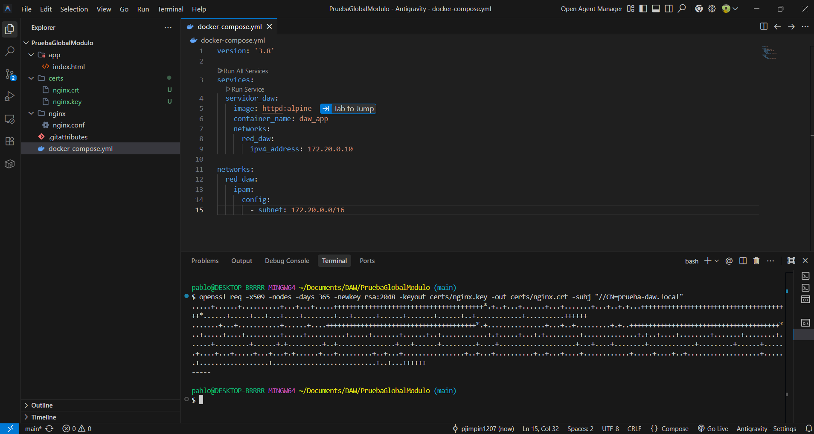

**Configuración Nginx:**

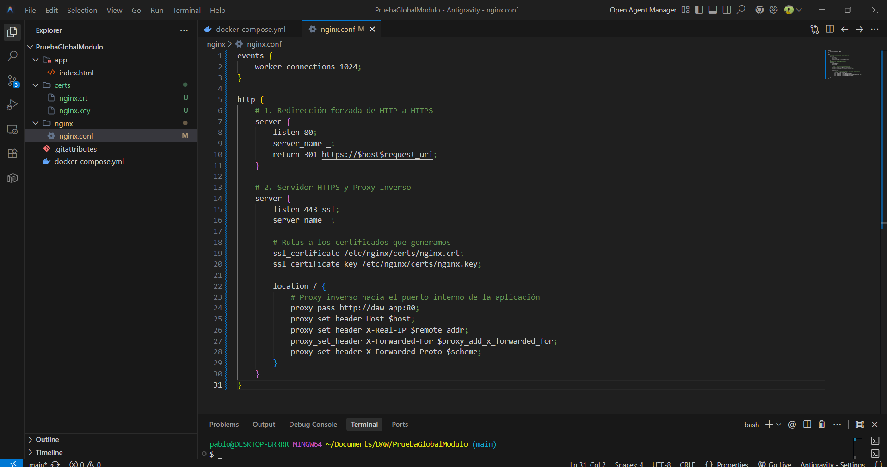

**Actualizar entorno Docker:**

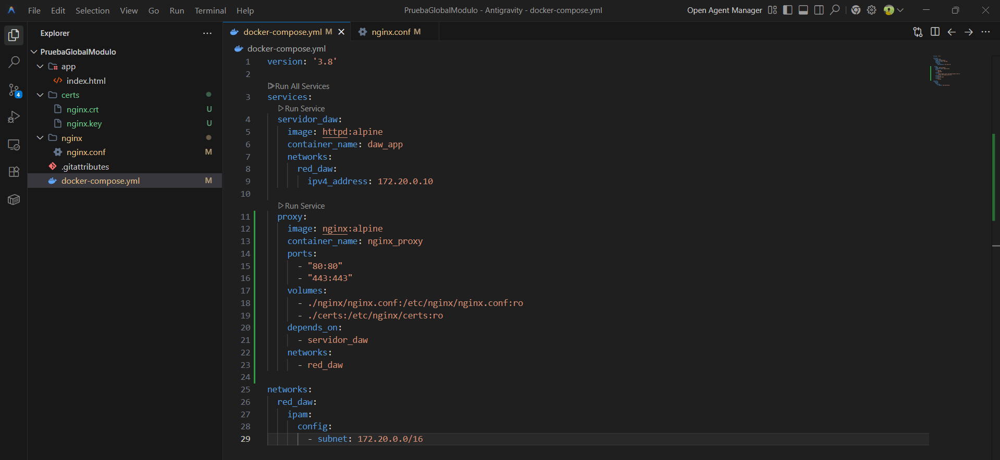

**Levantar cambios:**

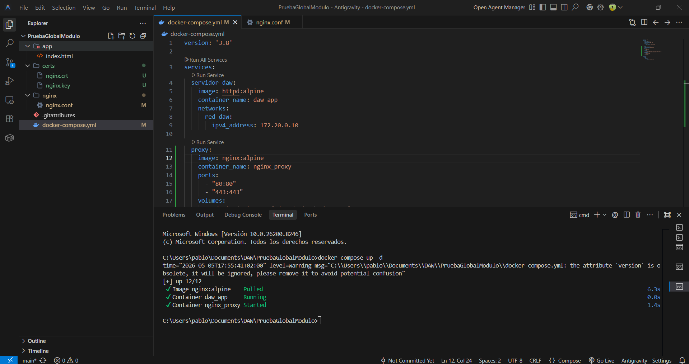

**Prueba de funcionamiento y Certificado:**

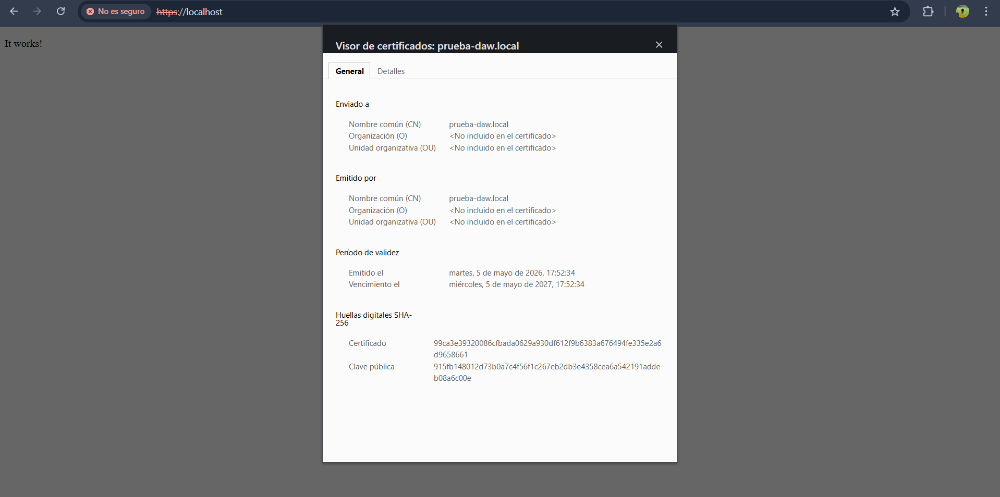

*Al acceder al servidor web, Nginx fuerza automáticamente la conexión a HTTPS. El navegador muestra la advertencia esperada al ser un certificado autofirmado, pero la encriptación SSL está activa y encriptando el tráfico.*

---

## Apartado 3 (RA3): Servidor de Aplicaciones y Despliegue

**Objetivo:** Desplegar la aplicación y verificar la comunicación correcta con el proxy inverso.

El código de la aplicación lo he alojado en el directorio local `./app`, y lo he montado como un volumen persistente dentro del contenedor `daw_app` (en la ruta raíz de Apache: `/usr/local/apache2/htdocs/`). Esto permite que el servidor de aplicaciones sirva los archivos sin necesidad de reconstruir la imagen.

**Prueba del funcionamiento:**

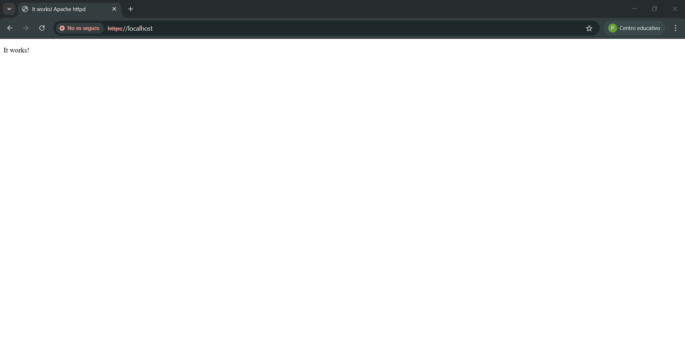

*Con esta captura evidencio que el despliegue es exitoso. El usuario accede por HTTPS a través del puerto seguro de Nginx, y este se comunica internamente con el contenedor Apache (`daw_app`) para devolver el contenido, demostrando la correcta integración de ambas capas.*

---

## Apartado 4 (RA4): Servidor de Transferencia de Archivos

**Objetivo:** Instalar un servidor SFTP enjaulado (chroot) para el usuario de despliegue.

He integrado el servicio `atmoz/sftp` en la arquitectura, mapeando el puerto 2222 del host al puerto 22 del contenedor.

*   **Configuración del usuario y Chroot:** He aprovisionado el usuario `deploy_user`. Mediante la configuración de los volúmenes en Docker, he montado el directorio `./app` (donde reside el código web) directamente en `/home/deploy_user/app`. La propia imagen aplica automáticamente una política de "enjaulado" (chroot) sobre el directorio *home* del usuario.

**Añadir el servidor SFTP a la infraestructura:**

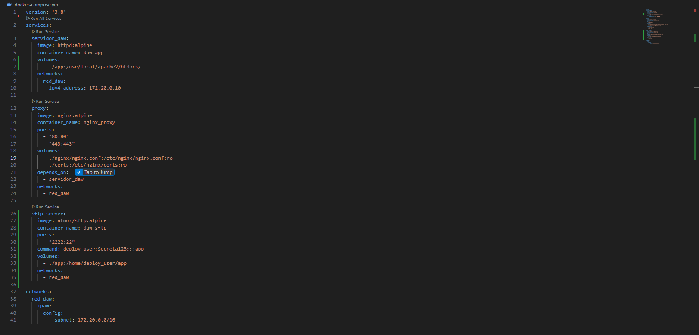

**Levantar SFTP:**

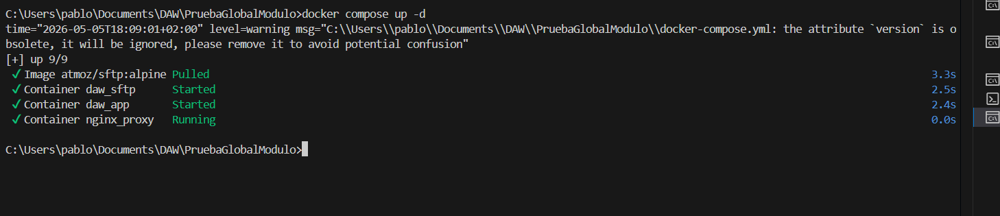

**Prueba de acceso (FileZilla):**

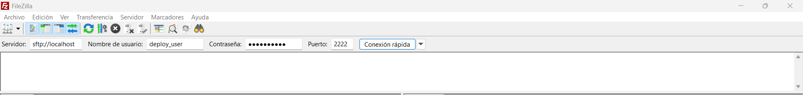

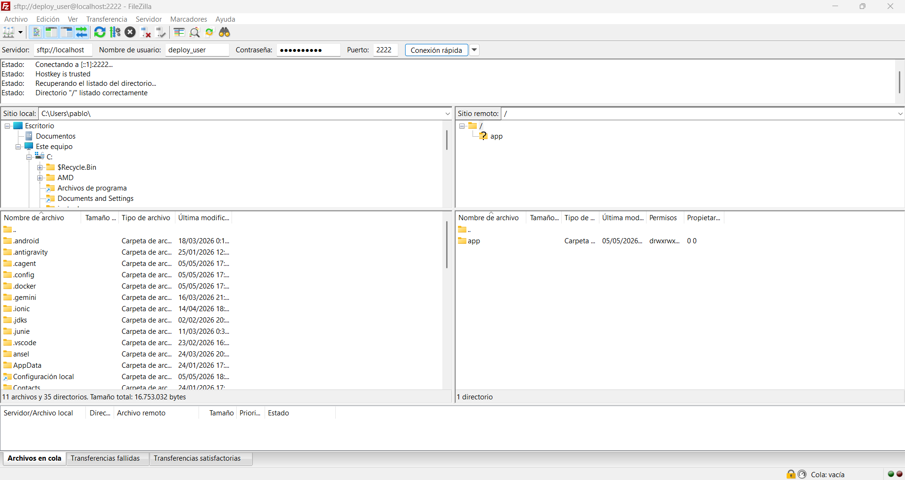

*En el cliente FileZilla confirmo la conexión exitosa al puerto 2222. En la ventana del "Sitio remoto", observo que el directorio raíz `/` es el límite superior para el usuario. Es imposible navegar a directorios del sistema operativo del servidor, garantizando la seguridad del entorno.

---

## Apartado 5 (RA5): Resolución de Nombres y Monitorización

**Objetivo:** Configurar el dominio local y monitorizar los registros (logs) en busca de errores provocados.

Para que la infraestructura responda a un dominio personalizado, he editado el archivo de resolución estática del sistema anfitrión (`hosts`), apuntando el dominio ficticio `prueba-daw.local` a la dirección de *loopback* (`127.0.0.1`).

Para probar la monitorización, he lanzado peticiones a recursos inexistentes (`/ruta1`, `/ruta2`) a través del navegador.

**Configurar la resolución de nombres local (El archivo hosts)**

**Provocar tres errores de acceso intencionados**

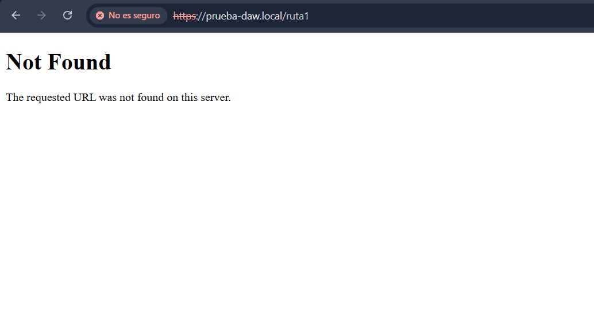

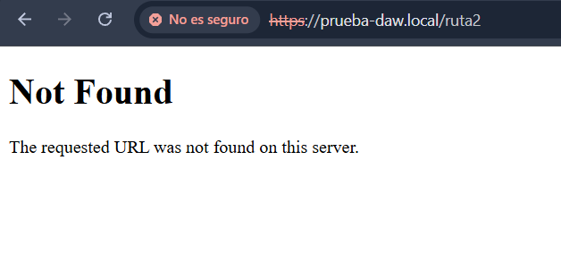

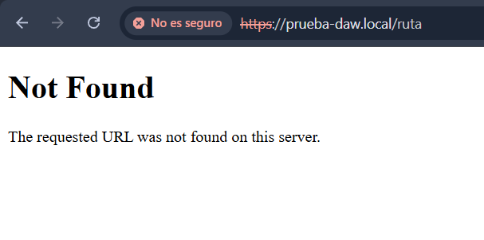

**Extracción del registro de errores:**

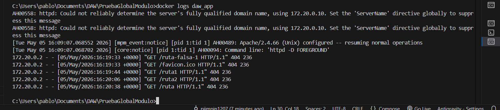

**Análisis técnico del registro (Log):**

*   **172.20.0.2:** Indica la dirección IP de origen de la petición. Al estar detrás de un proxy inverso, Apache no ve la IP real del cliente, sino la IP interna que Docker le ha asignado al contenedor `nginx_proxy`.
*   **GET /ruta-falsa-1:** Muestra el método HTTP utilizado para solicitar el recurso y la ruta exacta que se intentó alcanzar.
*   **404:** Es el código de estado de respuesta HTTP (*Not Found*), evidenciando que el servidor procesó la solicitud pero no encontró ningún archivo en dicha ruta, generando el error intencionado.

---

## Apartado 6 (RA6): Control de Versiones y Documentación

**Objetivo:** Documentar el proceso e implementar control de versiones Git.

Durante todo el proceso de despliegue, he gestionado la carpeta de configuración mediante un repositorio Git local. He realizado diversos *commits* lógicos que reflejan la evolución de la infraestructura (creación de la red, proxy inverso, servidor SFTP, etc.). 

También he subido el repositorio a GitHub: [https://github.com/pjimpin1207/PruebaGlobalModulo](https://github.com/pjimpin1207/PruebaGlobalModulo)